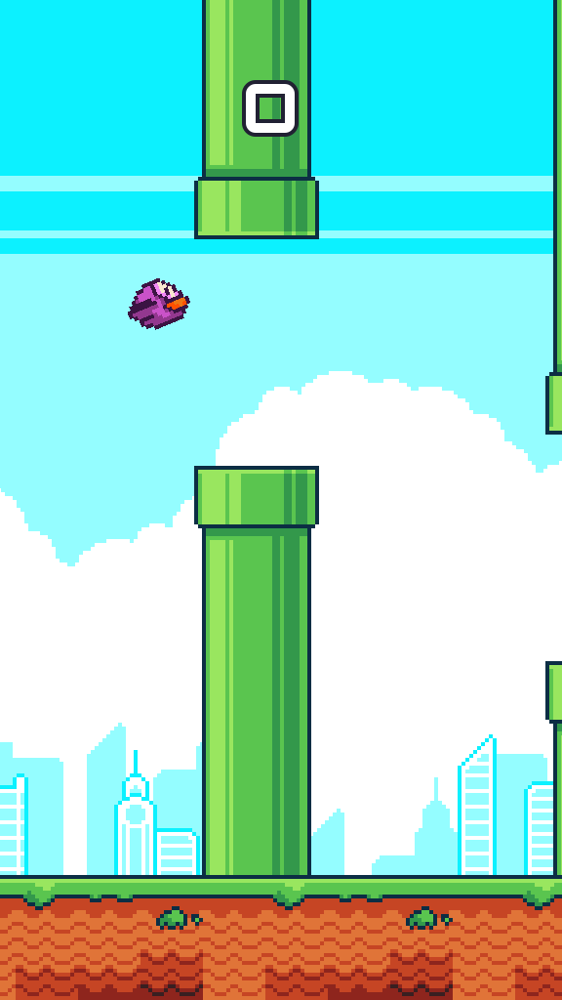
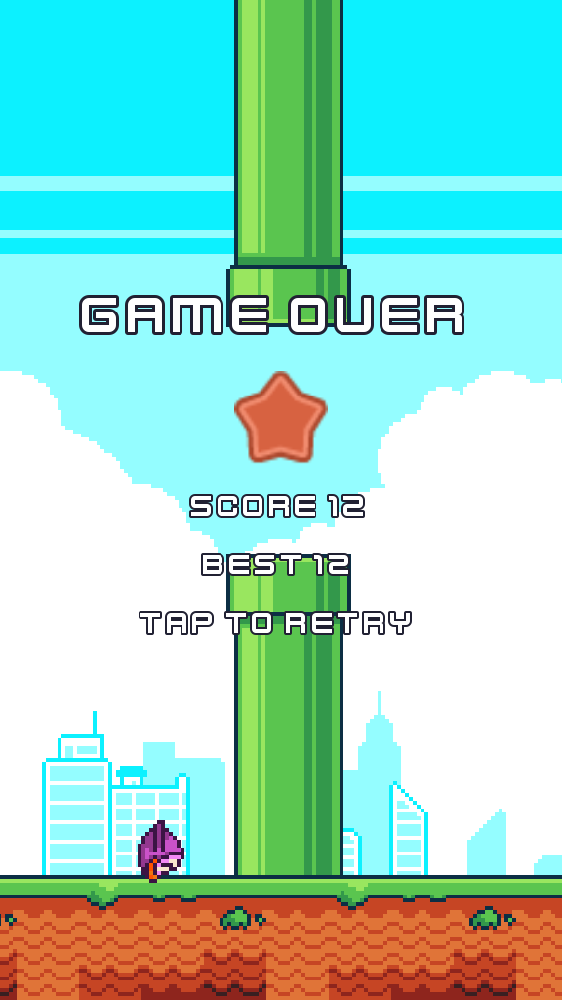

# Flappy Bird

A browser-playable recreation of Flappy Bird, built from scratch in **Godot 4.7** with typed GDScript and exported to HTML5. Tap, click, or press Space to flap, thread the pipes, and chase the medals.

<p align="center">
  
  &nbsp;&nbsp;
  
</p>

## Features

- Faithful core loop: gravity, single-impulse flap, tilt-on-dive, pipe pairs with a random gap, one point per pipe passed
- Medals at 10 / 20 / 30 / 40 points (bronze, silver, gold, platinum) and a best score that persists between sessions
- Seven bird colours and day / night skylines, picked at random each round
- Pixel-perfect scaling: the playfield is a fixed 256 units tall and the visible width follows the window or browser canvas, so it fills a phone in portrait, a desktop in landscape, or an iframe of any size without letterboxing
- Single-threaded web export that runs on plain static hosts such as GitHub Pages, no cross-origin isolation headers required

## Controls

| Input | Action |
| --- | --- |
| Tap / left click / Space / Up arrow | Flap (also starts a round and restarts after game over) |

## Project structure

```
assets/       CC0 sprites, sounds and font (see assets/CREDITS.md)
scenes/       main.tscn (game), bird.tscn, pipe_pair.tscn, hud.tscn
scripts/      one script per responsibility, no cross-cutting globals
tests/        scripted autopilot playthrough used as a smoke test
screenshots/  images for this README (ignored by the Godot importer)
```

| Script | Responsibility |
| --- | --- |
| `game_config.gd` | Single source of truth for tuning: scroll speed, gravity, flap impulse, pipe gap, spawn interval |
| `game.gd` | State machine (READY → PLAYING → GAME_OVER), input routing, score |
| `bird.gd` | Bird physics, wing animation, tilt, collision reporting |
| `pipe_pair.gd` | One top/bottom pipe pair that scrolls, despawns, and reports when passed |
| `pipe_spawner.gd` | Spawns pipe pairs at random gap heights just past the visible edge; freezes them on game over |
| `scrolling_backdrop.gd` | Parallax sky and ground, re-tiled to the visible width on resize |
| `hud.gd` | Score, ready prompt, game-over panel with medal |
| `medal.gd` | Score to medal tier mapping |
| `high_score_store.gd` | Best-score persistence with `ConfigFile` in `user://` |
| `sound_effects.gd` | Named sound playback |

Collision uses three physics layers (bird, pipes, ground). After a hit the bird's mask drops to ground-only so it tumbles to the floor the way the original does, and scoring is gated on game state so a falling bird can never earn a point.

## Running locally

Open the project folder in Godot 4.7 and press Play, or from a terminal:

```
godot --path .
```

## Smoke test

`tests/playthrough.gd` drives the game with a simple autopilot, passes twelve pipes, lets the bird land, and prints the resulting score, best score and medal state. It also saves screenshots to `build/screenshots/`. It needs a display (or a virtual one such as Xvfb) because it captures the viewport.

```
godot --path . -s res://tests/playthrough.gd
```

## Building for the web

Install the Web export templates once (Editor → Manage Export Templates), then:

```
godot --path . --headless --export-release Web build/web/index.html
```

`build/` is git-ignored. Serve the `build/web` folder from any static host, or upload it to itch.io as an HTML5 project. To embed it in a page, point an `<iframe>` at `index.html`; the game fills whatever size the frame is given.

## Credits

All art, audio and fonts are CC0 from [Megacrash](https://megacrash.itch.io/flappy-bird-assets) and [Kenney](https://kenney.nl). Full attribution and the sprite preparation steps are in [`assets/CREDITS.md`](assets/CREDITS.md). Flappy Bird was created by Dong Nguyen; this is an independent recreation for portfolio purposes and is not affiliated with the original.
